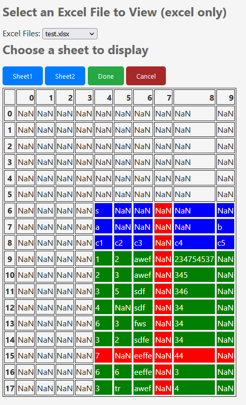

# Tayble

A flask app for loading excel sheets from a folder quickly, cleaning, and extracting to csv.

### Install

Simply, 
* clone the repo
* add all of your excel files to the data/ folder
* run 'source ./install.sh'. This will create and activate the venv and then run the app.
* Open the link (in the terminal) in a browser of your choice and start extracting!

### Usage

Tayble allows you to select a header region, data region and as many column/row removals as you like.

Select a region with two clicks. One for top left, and one bottom right. Cancel selection with cancel. 

* Headers will be combined verticaly and dupliacted horizontally where NaNs are present.
* Data will be extracted as is.
* Column/row removal will remove anthing within the column, data and header region.

Once you've made selections, click to extract the csv to the /data/csv/ folder

